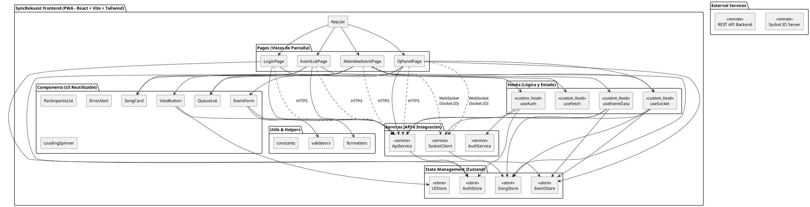

# Arquitectura Frontend - SyncRekuest PWA

## Diagrama de Arquitectura de Componentes




---

## Estructura de Carpetas

```
src/
├── App.jsx                    # Componente raíz con enrutamiento
├── main.jsx                   # Punto de entrada
├── index.css                  # Estilos globales
│
├── pages/
│   ├── LoginPage.jsx
│   ├── EventListPage.jsx
│   ├── AttendeeEventPage.jsx
│   └── DJPanelPage.jsx
│
├── components/
│   ├── SongCard.jsx
│   ├── VoteButton.jsx
│   ├── EventForm.jsx
│   ├── QueueList.jsx
│   ├── ParticipantsList.jsx
│   ├── ErrorAlert.jsx
│   └── LoadingSpinner.jsx
│
├── hooks/
│   ├── useAuth.js
│   ├── useSocket.js
│   ├── useEventData.js
│   └── useFetch.js
│
├── services/
│   ├── api.js
│   ├── socketClient.js
│   └── auth.js
│
├── stores/
│   ├── authStore.js
│   ├── eventStore.js
│   ├── songStore.js
│   └── uiStore.js
│
├── utils/
│   ├── formatters.js
│   ├── validators.js
│   └── constants.js
│
└── assets/
    ├── icons/
    ├── images/
    └── styles/
```

---

## Patrones de Comunicación

### 1. API REST (HTTP/HTTPS)

**Se usa para**: Operaciones con estado, autenticación, carga inicial de datos

**Flujo**:
```
Componente → ApiService → Axios → Backend REST API
→ AuthStore/EventStore/SongStore (almacenar resultado)
```

**Ejemplos**:
- `POST /api/auth/login` - Autenticación
- `GET /api/events` - Obtener lista de eventos
- `POST /api/events` - Crear evento (DJ)
- `POST /api/songs/suggestions` - Sugerir canción
- `POST /api/votes` - Emitir voto

**Encabezados**:
```
Authorization: Bearer <JWT_TOKEN>
Content-Type: application/json
```

---

### 2. WebSockets (Socket.IO)

**Se usa para**: Actualizaciones en tiempo real, comunicación bidireccional

**Conexión**:
```
SocketClient.connect(socketUrl, { token: jwtToken })
```

**Eventos del Servidor → Cliente**:
```
votes_updated         → Actualizar contador de votos
song_suggested        → DJ notificado de sugerencia
song_status_changed   → Transmitir cambio de estado
queue_updated         → Reordenar cola
participant_joined    → Notificación de nuevo asistente
event_closed          → Notificación de evento terminado
```

**Eventos del Cliente → Servidor**:
```
join_event            → Usuario se une a sala del evento
suggest_song          → Usuario envía canción
vote_song             → Usuario emite voto
leave_event           → Usuario abandona evento
```

---

## Gestión de Estado (Zustand)

### AuthStore
```javascript
// Almacena: token, usuario, isAuthenticated, rol
{
  token: string,
  user: { id, name, email, role },
  login(email, password),
  logout(),
  setToken(token),
  isAuthenticated: boolean
}
```

### EventStore
```javascript
// Almacena: evento actual, lista de eventos, eventos del usuario
{
  currentEvent: Event,
  events: Event[],
  loading: boolean,
  error: string,
  fetchEvents(),
  createEvent(data),
  joinEvent(code),
  leaveEvent()
}
```

### SongStore
```javascript
// Almacena: cola, sugerencias, detalles de canción, votos
{
  queue: Song[],
  suggestions: Song[],
  userVotes: Map<songId, vote>,
  loading: boolean,
  updateQueue(songs),
  addSong(song),
  updateVote(songId, count)
}
```

### UIStore
```javascript
// Almacena: estado de UI, modales, notificaciones
{
  notifications: Notification[],
  activeModal: string,
  loading: boolean,
  showNotification(msg),
  closeModal()
}
```

---

## Hooks Personalizados

### useAuth
```javascript
// Gestiona estado de autenticación y login/logout
const { user, isAuthenticated, login, logout } = useAuth();

// Uso:
if (!isAuthenticated) {
  return <LoginPage />;
}
```

### useSocket
```javascript
// Gestiona conexión Socket.IO y listeners de eventos
const { socket, connected, emit } = useSocket();

// Escucha eventos:
useEffect(() => {
  socket?.on('votes_updated', (data) => {
    // Actualizar UI
  });
}, [socket]);
```

### useEventData
```javascript
// Obtiene y gestiona datos del evento
const { event, queue, loading } = useEventData(eventId);

// Actualiza datos cuando sea necesario
const refresh = () => useEventData.refetch();
```

### useFetch
```javascript
// Hook genérico para llamadas de API
const { data, loading, error } = useFetch('/api/events');
```

---

## Responsabilidades de Componentes

### Páginas (Componentes de Nivel de Pantalla)

**LoginPage**
- Formulario de correo/contraseña
- Validación del lado del cliente
- Envío a backend
- Almacenamiento de token JWT
- Redirección en caso de éxito

**EventListPage**
- Obtener lista de eventos activos
- Mostrar tarjetas de eventos
- Filtrar/buscar eventos
- Botón para unirse/crear evento
- Conteo de participantes en tiempo real vía Socket.IO

**AttendeeEventPage**
- Mostrar cola de canciones
- Mostrar botones de voto
- Formulario de sugerencia de canción
- Actualizaciones en tiempo real vía Socket.IO
- Lista de participantes
- Ranking de cola por votos

**DJPanelPage**
- Detalles del evento (código, QR)
- Cola de moderación de canciones
- Aceptar/rechazar sugerencias
- Controles de saltar/reproducir
- Notificaciones en tiempo real
- Estadísticas del evento

### Componentes Reutilizables

**SongCard**
```
Props: song, onVote, onApprove, onReject
Muestra: Título, artista, votos, estado
```

**VoteButton**
```
Props: songId, currentVote, onVote
Muestra: Botón de voto, contador
Maneja: Clic → Llamada a API → Actualización
```

**QueueList**
```
Props: songs, onVote, onSelect
Muestra: Lista ordenada de canciones por votos
Características: Reordenamiento en tiempo real
```

**EventForm**
```
Props: onSubmit, loading
Campos: Nombre, ubicación, fecha, configuración
Validación: Del lado del cliente antes de envío
```

---

## Ejemplo de Flujo de Estado: Votación en una Canción

```
1. Usuario hace clic en VoteButton
   ↓
2. VoteButton se deshabilita (prevenir doble clic)
   ↓
3. Muestra indicador de carga
   ↓
4. Llama a ApiService.vote(songId, value)
   ↓
5. ApiService envía POST /api/votes con JWT
   ↓
6. Backend procesa y transmite vía Socket.IO
   ↓
7. SocketClient recibe evento "votes_updated"
   ↓
8. SongStore actualiza conteo de votos
   ↓
9. QueueList se re-renderiza con nuevo conteo
   ↓
10. Respuesta backend recibida
    ↓
11. VoteButton actualiza conteo final
    ↓
12. VoteButton se vuelve a habilitar
```

---

## Manejo de Errores

### Validación Frontend
- Verificación de formato de correo
- Validación de campos requeridos
- Validación de formato de código (6 caracteres)
- Validación de fecha/hora

### Manejo de Errores de API
```javascript
try {
  const response = await api.post('/api/votes', data);
  handleSuccess(response);
} catch (error) {
  if (error.response?.status === 401) {
    // No autorizado - redirigir a login
    logout();
  } else if (error.response?.status === 400) {
    // Solicitud incorrecta - mostrar error de validación
    showError(error.response.data.message);
  } else if (error.response?.status === 409) {
    // Conflicto - mostrar error específico
    showError('Ya votaste por esta canción');
  }
}
```

### Manejo de Errores de Red
- Mecanismo de reintentos
- Recargación a datos en caché si está disponible
- Detección de desconexión
- Cola de operaciones para reintentar

---

## Sincronización en Tiempo Real

### Listeners de Evento Socket.IO

**En AttendeeEventPage**:
```javascript
useEffect(() => {
  socket?.on('votes_updated', (data) => {
    SongStore.updateVote(data.songId, data.totalVotes);
    // QueueList se re-renderiza automáticamente
  });
  
  socket?.on('queue_updated', (data) => {
    SongStore.setQueue(data.queue);
    // Visualización se reordena
  });
}, [socket]);
```

**En DJPanelPage**:
```javascript
useEffect(() => {
  socket?.on('song_suggested', (data) => {
    // Mostrar notificación
    showNotification(`Nueva canción: ${data.song.title}`);
    // Actualizar cola de moderación
    EventStore.addSuggestion(data.song);
  });
}, [socket]);
```

---

## Optimizaciones de Rendimiento

1. **Code Splitting**
   - Cargar páginas perezosamente con React.lazy()
   - Cargar panel DJ solo si rol = DJ

2. **Gestión de Estado**
   - Solo suscribirse a estado necesario
   - Actualizaciones selectivas en Zustand

3. **Prevención de Re-renders**
   - useCallback para manejadores
   - Memoización para componentes costosos
   - Patrón de selector en stores

4. **Caché de Datos**
   - Cachear respuestas de API
   - Reutilizar datos al cambiar páginas
   - Invalidar caché en mutaciones

5. **Características PWA**
   - Service worker para offline
   - Caché de activos
   - Manifest para instalación

---

## Consideraciones de Seguridad

1. **Almacenamiento de JWT**
   - Almacenar en estado (React context)
   - Opcional: localStorage con bandera segura
   - Limpiar al cerrar sesión

2. **Validación de Entrada**
   - Validar antes del envío
   - Sanitizar entrada del usuario
   - Prevenir ataques de inyección

3. **CORS**
   - Conectar solo a backend confiable
   - Credenciales incluidas en solicitudes

4. **HTTPS Solo**
   - Aplicar conexiones seguras
   - Sin transmisión en texto plano

---

## Estrategia de Pruebas

### Pruebas Unitarias
- Renderización de componentes
- Lógica de hooks
- Mutaciones de store
- Funciones de utilidad

### Pruebas de Integración
- Flujo de llamada a API
- Manejo de eventos Socket.IO
- Sincronización de estado
- Envío de formularios

### Pruebas E2E
- Flujos completos del usuario
- Login → Explorar → Unirse → Votar
- DJ crear → gestionar → cerrar evento
- Compatibilidad entre navegadores

---

## Flujo de Desarrollo

```bash
# Instalar dependencias
npm install

# Servidor de desarrollo
npm run dev

# Compilación de producción
npm run build

# Previsualizar compilación
npm run preview

# Ejecutar pruebas
npm run test

# Pruebas E2E
npm run test:e2e
```

---

Esta arquitectura soporta:
- Votación colaborativa en tiempo real  
- Diseño PWA receptivo  
- Estructura de componentes escalable  
- Separación clara de responsabilidades  
- Pruebas y mantenimiento fáciles
