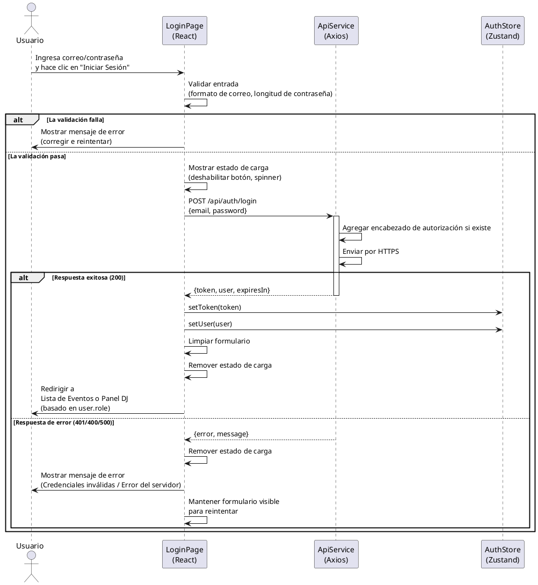
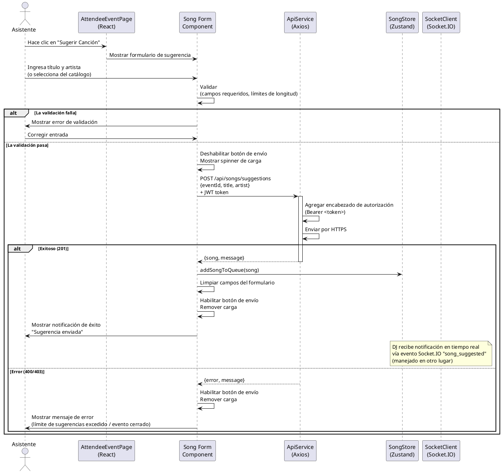
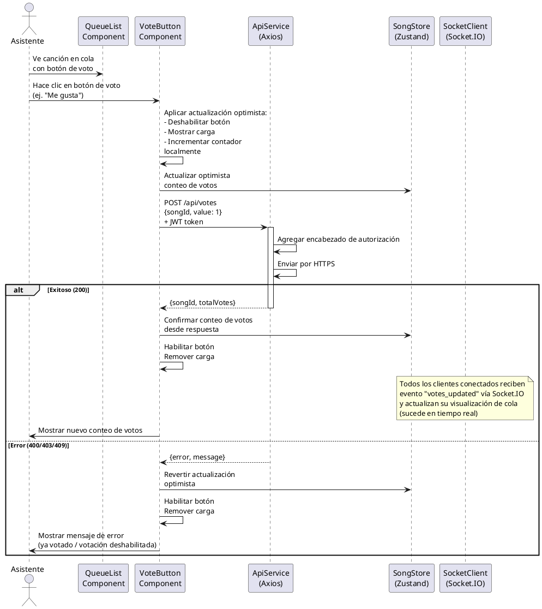
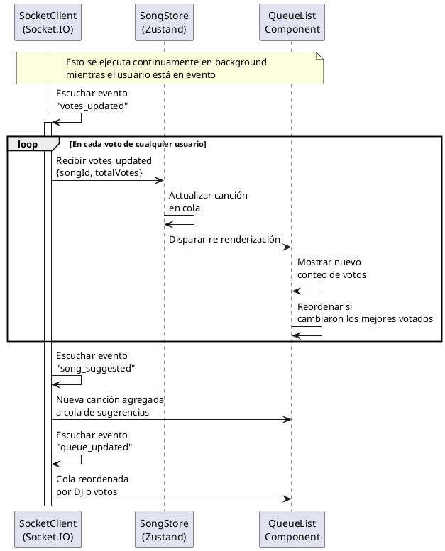

# Diagramas de Secuencia Frontend - SyncRekuest

**Enfoque**: Participación solo de frontend (interacciones UI → Backend)

---

## 1. Secuencia de Inicio de Sesión (Perspectiva Frontend)

Muestra solo los pasos donde el Frontend participa en el proceso de inicio de sesión.




### Acciones del Usuario

1. Usuario ingresa correo y contraseña
2. Hace clic en botón "Iniciar Sesión"
3. Frontend valida localmente
4. Frontend envía credenciales de forma segura
5. Recibe token JWT
6. Almacena token en estado de la aplicación
7. Redirige al panel apropiado

### Responsabilidades del Frontend

- Renderización de formulario e captura de entrada
- Validación del lado del cliente
- Gestión de estado de carga
- Visualización de errores
- Almacenamiento de token
- Navegación después del inicio de sesión

---

## 2. Secuencia de Sugerir Canción (Perspectiva Frontend)

Muestra interacción frontend cuando un asistente sugiere una canción.




### Acciones del Usuario

1. Asistente hace clic en botón "Sugerir Canción"
2. Aparece formulario con campos título/artista
3. Ingresa información de canción
4. Hace clic en envío
5. Frontend valida entrada
6. Envía a backend
7. Recibe confirmación
8. Formulario se limpia, usuario ve mensaje de éxito
9. Nueva canción aparece en cola (si se aprueba)

### Responsabilidades del Frontend

- Renderización del formulario de canción
- Validación de entrada
- Gestión de estado de envío (carga/deshabilitado)
- Manejo de errores y visualización
- Actualizaciones de cola
- Retroalimentación de éxito

---

## 3. Secuencia de Votación de Canción (Perspectiva Frontend)

Muestra interacción frontend cuando un asistente vota en una canción, incluyendo actualizaciones optimistas.




### Acciones del Usuario

1. Asistente ve canción en cola
2. Hace clic en botón de voto (generalmente "Me gusta" o "👍")
3. Frontend muestra actualización optimista inmediatamente
4. Voto se envía a backend
5. Todos los asistentes ven conteo de votos actualizado en tiempo real
6. Cola se reordena por popularidad

### Responsabilidades del Frontend

- Renderización del botón de voto
- Actualización optimista de UI (retroalimentación inmediata)
- Gestión de estado de carga durante envío
- Revertir actualización optimista en error
- Visualización del conteo de votos
- Configuración del listener de socket en tiempo real

### Flujo de Actualización Optimista

```
Usuario hace clic
    ↓
Deshabilitar botón + Mostrar carga
    ↓
Incrementar contador localmente (usuario lo ve inmediatamente)
    ↓
Enviar solicitud de API
    ↓
Si éxito → Confirmar conteo desde servidor
Si error → Revertir conteo al valor anterior
    ↓
Habilitar botón + Ocultar carga
```

---

## Listener Socket.IO en Tiempo Real (Background)

Mientras las secuencias anteriores muestran interacciones directas del usuario, los listeners Socket.IO se ejecutan continuamente:




---

## Flujo de Interacción de Componentes

### Flujo de Inicio de Sesión

```
Entrada del Usuario
    ↓
LoginPage valida
    ↓
Envía a ApiService
    ↓
Almacena en AuthStore
    ↓
Redirige a EventListPage o DJPanelPage
```

### Flujo de Votación

```
Usuario hace clic en VoteButton
    ↓
Actualización optimista en SongStore
    ↓
Envía a ApiService
    ↓
SocketClient escucha
    ↓
Todos los suscriptores (QueueList, otros componentes)
    ↓
Actualización inmediata de UI (sin recarga de página)
```

### Flujo de Participación en Evento

```
Usuario se une a evento
    ↓
AttendeeEventPage se monta
    ↓
SocketClient se conecta a sala del evento
    ↓
Obtiene cola inicial
    ↓
Escucha eventos de socket
    ↓
Actualizaciones en tiempo real
```

---

## Manejo de Errores en Frontend

### Errores de Red

```
Llamada a API falla (sin conexión)
    ↓
Atrapar error en ApiService
    ↓
Mostrar "Error de conexión"
    ↓
Mostrar botón de reintentar
    ↓
Usuario puede reintentar operación
```

### Errores de Validación (400)

```
Backend rechaza entrada
    ↓
Mostrar mensaje de error específico
    ↓
Resaltar campo inválido
    ↓
Permitir usuario corregir y reintentar
```

### Errores de Autenticación (401)

```
Token expirado o inválido
    ↓
Backend devuelve 401
    ↓
Limpiar AuthStore
    ↓
Redirigir a LoginPage
    ↓
Usuario debe iniciar sesión nuevamente
```

### Errores de Permiso (403)

```
Usuario carece de permisos
    ↓
Mostrar "Acceso denegado"
    ↓
Redirigir a página apropiada
    ↓
Usuario dirigido a Lista de Eventos
```

### Errores de Conflicto (409)

```
Intento de voto duplicado
    ↓
Mostrar "Ya votaste"
    ↓
Revertir UI optimista
    ↓
Mantener botón habilitado para que usuario reintente si es necesario
```

---

## Resumen de Flujo de Datos Frontend

### Inicio de Sesión

Entrada del Usuario → Validación → ApiService → AuthStore → Navegación

### Explorar Eventos

Montaje → Obtención de ApiService → EventStore → Renderización de EventListPage

### Unirse a Evento

Botón de unión → ApiService → Conexión de SocketClient → Obtención de cola → AttendeeEventPage

### Sugerir Canción

Entrada del formulario → Validación → ApiService → SongStore → Actualización de cola

### Votar

Hacer clic en botón → Actualización optimista → ApiService → Listener de socket → Actualización de cola

---

## Características Clave del Frontend

- **Validación del lado del cliente** - Fallar rápido antes de llamada al servidor
- **Actualizaciones optimistas** - Retroalimentación inmediata de UI
- **Recuperación de errores** - Mecanismos de reintentos
- **Sincronización en tiempo real** - Listeners Socket.IO
- **Estados de carga** - Retroalimentación del usuario durante operaciones asincrónicas
- **Gestión de token** - Almacenamiento y actualización JWT
- **Soporte PWA** - Funciona offline con service worker

---

## Tecnologías Frontend Utilizadas

| Tecnología       | Propósito                                 |
| ---------------- | ----------------------------------------- |
| React            | Componentes UI y estado                   |
| Vite             | Herramienta de compilación y servidor dev |
| Zustand          | Gestión de estado                         |
| Axios            | Cliente HTTP                              |
| Socket.IO Client | Comunicación en tiempo real               |
| React Router     | Navegación                                |
| Tailwind CSS     | Estilos                                   |

---

Este documento se enfoca en **Participación de Frontend** en secuencias del sistema. Para flujos completos de extremo a extremo incluyendo Backend y Base de Datos, ver `docs/sequence-global.md`.
