# Casos de Uso Frontend - SyncRekuest

**Enfoque**: Funcionalidad orientada al usuario desde la perspectiva del cliente (sin lógica del servidor)

---

## Lista Completa de Casos de Uso Frontend

### Casos de Uso de Autenticación (Asistente y DJ)

**UC-FE-001: Iniciar Sesión en la Aplicación**
- Actor: Asistente, DJ
- Precondición: El usuario tiene cuenta registrada
- Flujo: Ingresar correo/contraseña → Validar → Recibir token → Redirigir al panel
- UI: Componente LoginPage
- Post-condición: Usuario autenticado, viendo panel apropiado

**UC-FE-002: Ver Perfil de Usuario**
- Actor: Asistente, DJ, Admin
- Precondición: Usuario ha iniciado sesión
- Flujo: Hacer clic en ícono de perfil → Ver nombre, correo, rol → Opción de cerrar sesión
- UI: Menú/modal de perfil
- Post-condición: Información del usuario mostrada

**UC-FE-003: Cerrar Sesión de Aplicación**
- Actor: Asistente, DJ, Admin
- Precondición: Usuario ha iniciado sesión
- Flujo: Hacer clic en cerrar sesión → Confirmar → Limpiar token → Redirigir a login
- UI: Menú de perfil → Botón cerrar sesión
- Post-condición: Sesión terminada, redirigido a LoginPage

---

### Casos de Uso de Exploración de Eventos (Asistente y DJ)

**UC-FE-004: Ver Lista de Eventos Activos**
- Actor: Asistente, DJ
- Precondición: Usuario ha iniciado sesión
- Flujo: Navegar a Eventos → Mostrar lista con filtros → Ver detalles
- UI: Componente EventListPage
- Características:
  - Listar todos los eventos activos
  - Mostrar nombre de DJ, conteo de participantes
  - Filtrar por fecha, DJ, estado
  - Ordenar por más nuevo, más activo
- Post-condición: Usuario ve eventos disponibles con opción de unirse

**UC-FE-005: Buscar Eventos**
- Actor: Asistente, DJ
- Precondición: En página de Lista de Eventos
- Flujo: Ingresar término de búsqueda → Filtrar eventos → Ver resultados coincidentes
- UI: Campo de búsqueda en EventListPage
- Características:
  - Buscar por nombre de evento
  - Buscar por nombre de DJ
  - Filtrado en tiempo real
- Post-condición: Lista de eventos filtrada mostrada

**UC-FE-006: Filtrar Eventos por Estado**
- Actor: Asistente, DJ
- Precondición: En página de Lista de Eventos
- Flujo: Seleccionar filtro → Aplicar → Ver resultados filtrados
- UI: Dropdown/botones de filtro
- Características:
  - Filtrar por ACTIVO, CERRADO, BORRADOR
  - Filtrar por roles (mostrar mis eventos)
- Post-condición: Eventos filtrados mostrados

---

### Casos de Uso de Participación en Evento (Asistente)

**UC-FE-007: Unirse a Evento por Código**
- Actor: Asistente
- Precondición: Usuario ha iniciado sesión, conoce código de evento
- Flujo: Hacer clic en "Unirse a Evento" → Ingresar código → Enviar → Unirse a evento
- UI: JoinEventModal / Página
- Validación: 6 caracteres alfanuméricos mayúsculos
- Post-condición: Asistente en evento, ve cola

**UC-FE-008: Unirse a Evento por Código QR**
- Actor: Asistente
- Precondición: Tiene acceso a cámara, código QR visible
- Flujo: Escanear QR → Extraer código → Unirse automáticamente → Entrar a evento
- UI: Componente escáner QR
- Características:
  - Solicitud de permiso de cámara
  - Detección en vivo de QR
  - Envío automático de código extraído
- Post-condición: Asistente en evento, ve cola

**UC-FE-009: Ver Cola de Evento Actual**
- Actor: Asistente
- Precondición: Asistente en evento activo
- Flujo: Ver cola de canciones → Mostrar ordenadas por votos → Actualizaciones en tiempo real
- UI: Componente QueueList en AttendeeEventPage
- Características:
  - Mostrar todas las canciones sugeridas
  - Ordenar por conteo de votos
  - Mostrar estado (PENDIENTE, APROBADO, REPRODUCIENDO)
  - Mostrar quién sugirió cada canción
  - Actualizaciones en tiempo real vía Socket.IO
- Post-condición: Usuario ve cola dinámica

**UC-FE-010: Abandonar Evento**
- Actor: Asistente
- Precondición: En evento activo
- Flujo: Hacer clic en "Abandonar" → Confirmar → Salir de evento → Volver a lista de eventos
- UI: Botón abandonar en AttendeeEventPage
- Post-condición: Asistente desconectado del evento

---

### Casos de Uso de Interacción con Canciones (Asistente)

**UC-FE-011: Sugerir Canción**
- Actor: Asistente
- Precondición: Asistente en evento activo, no ha excedido límite
- Flujo: Hacer clic en "Sugerir Canción" → Ingresar título/artista → Enviar
- UI: Componente SongSuggestionForm
- Validación:
  - Título no vacío
  - Artista no vacío
  - Límites de caracteres
  - No exceder límite de sugerencias
- Post-condición: Canción agregada a cola de sugerencias

**UC-FE-012: Ver Detalles de Canción**
- Actor: Asistente
- Precondición: Canción visible en cola
- Flujo: Hacer clic en tarjeta de canción → Ver detalles completos → Votos actuales → Quién sugirió
- UI: Modal de detalles de canción
- Características:
  - Título, artista
  - Número de votos
  - Quién la sugirió
  - Estado
  - Estado de voto del usuario actual
- Post-condición: Usuario ve información detallada de canción

**UC-FE-013: Votar en Canción Sugerida**
- Actor: Asistente
- Precondición: Estado de canción es APROBADO o REPRODUCIENDO
- Flujo: Hacer clic en botón de voto → Actualización optimista de UI → Enviar solicitud
- UI: Componente VoteButton en SongCard
- Características:
  - Deshabilitar después de votado
  - Mostrar estado de carga
  - Actualización optimista del contador
  - Actualizaciones en tiempo real del conteo desde otros votantes
  - Mostrar conteo de votos actual
- Post-condición: Voto registrado, cola se actualiza en tiempo real

**UC-FE-014: Ver Ranking de Canciones**
- Actor: Asistente
- Precondición: En evento activo
- Flujo: Ver cola ordenada por votos → Ver canciones principales primero
- UI: QueueList con visualización ordenada por votos
- Características:
  - Ordenar por conteo de votos
  - Números de posición (1º, 2º, 3º, etc.)
  - Visualización de conteo de votos
  - Reordenamiento en tiempo real
- Post-condición: Usuario ve ranking de popularidad

---

### Casos de Uso de Estadísticas de Evento (Asistente y DJ)

**UC-FE-015: Ver Estadísticas del Evento**
- Actor: Asistente, DJ
- Precondición: En evento activo o vista de detalles de evento
- Flujo: Hacer clic en estadísticas → Ver métricas del evento
- UI: Panel/modal de estadísticas de evento
- Métricas mostradas:
  - Total de participantes
  - Total de sugerencias
  - Total de votos
  - Canción con más votos
  - Duración del evento
- Post-condición: Estadísticas mostradas

**UC-FE-016: Ver Historial de Votación Personal**
- Actor: Asistente
- Precondición: En evento, ha votado en canciones
- Flujo: Hacer clic en "Mis Votos" → Ver canciones votadas → Conteos de votos
- UI: Panel de historial de votación
- Características:
  - Listar canciones votadas por usuario
  - Mostrar estado de voto del usuario
  - Mostrar conteos de votos actuales
- Post-condición: Usuario ve su actividad de votación

---

### Casos de Uso Específicos de DJ

**UC-FE-017: Crear Evento (DJ)**
- Actor: DJ
- Precondición: Usuario ha iniciado sesión con rol = DJ
- Flujo: Hacer clic en "Crear Evento" → Completar formulario → Enviar → Obtener código + QR
- UI: CreateEventPage con EventForm
- Campos del formulario:
  - Nombre del evento (requerido)
  - Ubicación (opcional)
  - Fecha/hora de inicio (requerido, futuro)
  - Opciones de configuración
- Post-condición: Evento creado, DJ ve panel de control

**UC-FE-018: Configurar Ajustes de Evento (DJ)**
- Actor: DJ
- Precondición: DJ en su propio evento (estado BORRADOR o ACTIVO)
- Flujo: Hacer clic en configuración → Modificar opciones → Guardar cambios
- UI: Panel/modal de configuración de evento
- Configurable:
  - Máximo de sugerencias por usuario
  - Votación habilitada/deshabilitada
  - Permitir participantes anónimos
  - Visibilidad del evento
- Post-condición: Configuración actualizada, cambios aplicados

**UC-FE-019: Panel DJ - Gestionar Sugerencias**
- Actor: DJ
- Precondición: DJ en evento activo
- Flujo: Ver sugerencias pendientes → Aprobar/Rechazar → Actualizar cola
- UI: DJPanelPage con cola de moderación
- Características:
  - Listar sugerencias pendientes
  - Vista previa de detalles de canción
  - Botón de aprobación (mover a cola principal)
  - Botón de rechazo (eliminar)
  - Notificaciones en tiempo real de nuevas sugerencias
- Post-condición: Sugerencias moderadas, cola actualizada

**UC-FE-020: Panel DJ - Controlar Reproducción**
- Actor: DJ
- Precondición: DJ en evento activo
- Flujo: Ver canción actual → Controles de saltar/reproducir
- UI: Controles de reproducción en DJPanelPage
- Características:
  - Saltar canción actual
  - Reproducir siguiente canción
  - Marcar canción como reproducida
  - Mostrar ahora reproduciendo
- Post-condición: Reproducción controlada

**UC-FE-021: Panel DJ - Ver Actualizaciones en Tiempo Real**
- Actor: DJ
- Precondición: DJ en panel de evento
- Flujo: Ver votos actualizándose en tiempo real → Ver nuevas sugerencias aparecer
- UI: DJPanelPage con actualizaciones en vivo
- Eventos en tiempo real:
  - votes_updated → cola se reordena
  - song_suggested → notificación + actualización de cola
  - participant_joined → actualización de conteo de participantes
- Post-condición: DJ ve actividad del evento en vivo

**UC-FE-022: Panel DJ - Copiar Código de Evento**
- Actor: DJ
- Precondición: En su propio evento
- Flujo: Hacer clic en código → Copiar al portapapeles → Compartir con asistentes
- UI: Visualización de código de evento con botón de copiar
- Características:
  - Hacer clic para copiar
  - Mostrar confirmación "¡Copiado!"
  - Mostrar en formato legible
- Post-condición: Código copiado, listo para compartir

**UC-FE-023: Panel DJ - Descargar Código QR**
- Actor: DJ
- Precondición: En su propio evento
- Flujo: Hacer clic en código QR → Descargar o Imprimir → Compartir con asistentes
- UI: Imagen de código QR con botón de descarga
- Características:
  - Mostrar imagen de código QR
  - Descargar como PNG
  - Opción de impresión
- Post-condición: Código QR disponible para distribuir

**UC-FE-024: Panel DJ - Cerrar Evento**
- Actor: DJ
- Precondición: Evento está ACTIVO
- Flujo: Hacer clic en "Cerrar Evento" → Confirmar → Evento termina → Mostrar resumen
- UI: Botón cerrar evento con modal de confirmación
- Post-condición: Evento cerrado, participantes desconectados, resumen mostrado

---

### Características en Tiempo Real (Todos los Usuarios)

**UC-FE-025: Recibir Notificaciones en Tiempo Real**
- Actor: Asistente, DJ
- Precondición: En evento activo con Socket.IO conectado
- Flujo: Eventos ocurren → Notificaciones Toast aparecen
- UI: Componente de notificación Toast
- Notificaciones:
  - Nueva canción sugerida
  - Participante se unió
  - Conteo de votos actualizado
  - Canción aprobada
  - Evento se cerrará
- Post-condición: Usuario ve actualizaciones en tiempo real

**UC-FE-026: Ver Actualizaciones de Cola en Tiempo Real**
- Actor: Asistente, DJ
- Precondición: En evento activo, viendo cola
- Flujo: Otro asistente vota → Cola se reordena inmediatamente
- UI: QueueList con actualizaciones dinámicas
- Características:
  - Conteos de votos se actualizan en vivo
  - Orden de canciones cambia en tiempo real
  - Sin necesidad de recarga de página
  - Animaciones suaves
- Post-condición: Cola siempre muestra estado actual

**UC-FE-027: Ver Conteo de Participantes en Tiempo Real**
- Actor: Asistente, DJ
- Precondición: En evento activo
- Flujo: Usuario se une/abandona → Conteo de participantes se actualiza
- UI: Contador de participantes en encabezado de evento
- Características:
  - Muestra conteo actual
  - Se actualiza cuando asistentes se unen/abandonan
  - Lista de participantes actuales
- Post-condición: Siempre muestra conteo de participantes actual

---

### Características de UI/UX (Todos los Usuarios)

**UC-FE-028: Ver Estados de Carga**
- Actor: Todos los usuarios
- Precondición: Cualquier operación asincrónica en progreso
- Flujo: Acción disparada → Indicador de carga mostrado → Operación completa
- UI: Spinners de carga, botones deshabilitados
- Post-condición: Usuario entiende que algo está sucediendo

**UC-FE-029: Ver Mensajes de Error**
- Actor: Todos los usuarios
- Precondición: Error ocurre durante operación
- Flujo: Error sucede → Mensaje de error mostrado → Opciones para reintentar
- UI: Alertas de error, mensajes de validación inline
- Características:
  - Descripción clara del error
  - Sugerencias prácticas
  - Botón de reintentar
  - Opción de descartar
- Post-condición: Usuario entiende qué salió mal

**UC-FE-030: Interfaz Receptiva Móvil**
- Actor: Todos los usuarios
- Precondición: Accediendo en dispositivo móvil
- Flujo: Ver en teléfono/tableta → UI se adapta → Controles amigables al tacto
- UI: Diseño receptivo con Tailwind CSS
- Características:
  - Menú móvil
  - Botones amigables al tacto
  - Legible en pantallas pequeñas
  - Funcionalidad completa en móvil
- Post-condición: Aplicación funciona sin problemas en móvil

**UC-FE-031: Soporte de Modo Oscuro (Opcional)**
- Actor: Todos los usuarios
- Precondición: Usuario prefiere modo oscuro
- Flujo: Habilitar modo oscuro → UI cambia de tema → Preferencia guardada
- UI: Cambio de tema, estilos de modo oscuro
- Post-condición: Aplicación se muestra en tema oscuro

**UC-FE-032: Características de Accesibilidad**
- Actor: Usuarios con necesidades de accesibilidad
- Precondición: Usando herramientas de accesibilidad (lectores de pantalla, etc.)
- Flujo: Navegar con teclado → Todas las funciones accesibles
- UI: Etiquetas ARIA, HTML semántico, navegación por teclado
- Características:
  - Navegación solo por teclado
  - Soporte de lector de pantalla
  - Opción de alto contraste
  - Indicadores de enfoque
- Post-condición: Aplicación completamente accesible

---

## Diagrama de Casos de Uso Frontend

```plantuml
@startuml
left to right direction

actor "Asistente" as Attendee
actor "DJ" as DJ
actor "Admin" as Admin

usecase "UC-FE-001: Iniciar Sesión" as UC_Login
usecase "UC-FE-002: Ver Perfil" as UC_Profile
usecase "UC-FE-003: Cerrar Sesión" as UC_Logout

usecase "UC-FE-004: Ver Eventos" as UC_ViewEvents
usecase "UC-FE-005: Buscar Eventos" as UC_Search
usecase "UC-FE-006: Filtrar Eventos" as UC_Filter

usecase "UC-FE-007: Unirse por Código" as UC_JoinCode
usecase "UC-FE-008: Unirse por QR" as UC_JoinQR
usecase "UC-FE-009: Ver Cola" as UC_ViewQueue
usecase "UC-FE-010: Abandonar Evento" as UC_LeaveEvent

usecase "UC-FE-011: Sugerir Canción" as UC_Suggest
usecase "UC-FE-012: Ver Detalles de Canción" as UC_SongDetails
usecase "UC-FE-013: Votar en Canción" as UC_Vote
usecase "UC-FE-014: Ver Ranking" as UC_Ranking

usecase "UC-FE-015: Estadísticas del Evento" as UC_Stats
usecase "UC-FE-016: Historial de Votación" as UC_History

usecase "UC-FE-017: Crear Evento" as UC_Create
usecase "UC-FE-018: Configurar Ajustes" as UC_Configure
usecase "UC-FE-019: Gestionar Sugerencias" as UC_Manage
usecase "UC-FE-020: Controlar Reproducción" as UC_Playback
usecase "UC-FE-021: Actualizaciones en Tiempo Real" as UC_RTUpdates
usecase "UC-FE-022: Copiar Código" as UC_CopyCode
usecase "UC-FE-023: Descargar QR" as UC_DownloadQR
usecase "UC-FE-024: Cerrar Evento" as UC_CloseEvent

usecase "UC-FE-025: Notificaciones" as UC_Notify
usecase "UC-FE-026: Actualizaciones de Cola" as UC_QueueUpdates
usecase "UC-FE-027: Conteo de Participantes" as UC_ParticipantCount

usecase "UC-FE-028: Estados de Carga" as UC_Loading
usecase "UC-FE-029: Mensajes de Error" as UC_Errors
usecase "UC-FE-030: Receptivo Móvil" as UC_Mobile
usecase "UC-FE-031: Modo Oscuro" as UC_DarkMode
usecase "UC-FE-032: Accesibilidad" as UC_Accessibility

Attendee --> UC_Login
Attendee --> UC_Profile
Attendee --> UC_Logout
Attendee --> UC_ViewEvents
Attendee --> UC_Search
Attendee --> UC_Filter
Attendee --> UC_JoinCode
Attendee --> UC_JoinQR
Attendee --> UC_ViewQueue
Attendee --> UC_LeaveEvent
Attendee --> UC_Suggest
Attendee --> UC_SongDetails
Attendee --> UC_Vote
Attendee --> UC_Ranking
Attendee --> UC_Stats
Attendee --> UC_History
Attendee --> UC_Notify
Attendee --> UC_QueueUpdates
Attendee --> UC_ParticipantCount
Attendee --> UC_Loading
Attendee --> UC_Errors
Attendee --> UC_Mobile

DJ --> UC_Login
DJ --> UC_Profile
DJ --> UC_Logout
DJ --> UC_ViewEvents
DJ --> UC_Create
DJ --> UC_Configure
DJ --> UC_Manage
DJ --> UC_Playback
DJ --> UC_RTUpdates
DJ --> UC_CopyCode
DJ --> UC_DownloadQR
DJ --> UC_CloseEvent
DJ --> UC_Stats
DJ --> UC_Notify
DJ --> UC_QueueUpdates
DJ --> UC_ParticipantCount
DJ --> UC_Loading
DJ --> UC_Errors
DJ --> UC_Mobile

UC_JoinCode .> UC_ViewQueue : <<include>>
UC_JoinQR .> UC_ViewQueue : <<include>>
UC_Vote .> UC_ViewQueue : <<include>>
UC_Suggest .> UC_ViewQueue : <<include>>
UC_Create .> UC_Login : <<include>>
UC_Manage .> UC_ViewQueue : <<include>>

@enduml
```

---

## Tabla Resumen

| Caso de Uso | Actor | Componente UI | ¿Tiempo Real? |
|----------|-------|-------------|-----------|
| UC-FE-001 | Asistente, DJ | LoginPage | No |
| UC-FE-004 | Asistente, DJ | EventListPage | No |
| UC-FE-007 | Asistente | JoinEventModal | No |
| UC-FE-009 | Asistente, DJ | QueueList | Sí |
| UC-FE-011 | Asistente | SongSuggestionForm | No |
| UC-FE-013 | Asistente | VoteButton | Sí |
| UC-FE-017 | DJ | CreateEventPage | No |
| UC-FE-019 | DJ | DJPanelPage | Sí |
| UC-FE-025 | Todos | Toast Component | Sí |
| UC-FE-026 | Todos | QueueList | Sí |

---

## Puntos Clave

✅ **Sin lógica backend** - Solo operaciones UI y orientadas al usuario  
✅ **Sin consultas a base de datos** - Llamadas a API abstraídas a través de servicios  
✅ **Conciencia en tiempo real** - Listeners Socket.IO documentados  
✅ **Mobile-first** - Todos los casos de uso receptivos  
✅ **Accesibilidad** - Incluida en características UX  
✅ **Manejo de errores** - Mensajes de error amigables al usuario  

---

**Nota**: Los casos de uso específicos de backend (funciones de administrador, operaciones de base de datos, lógica del servidor) están documentados en `docs-backend/use-cases-backend.md`.
